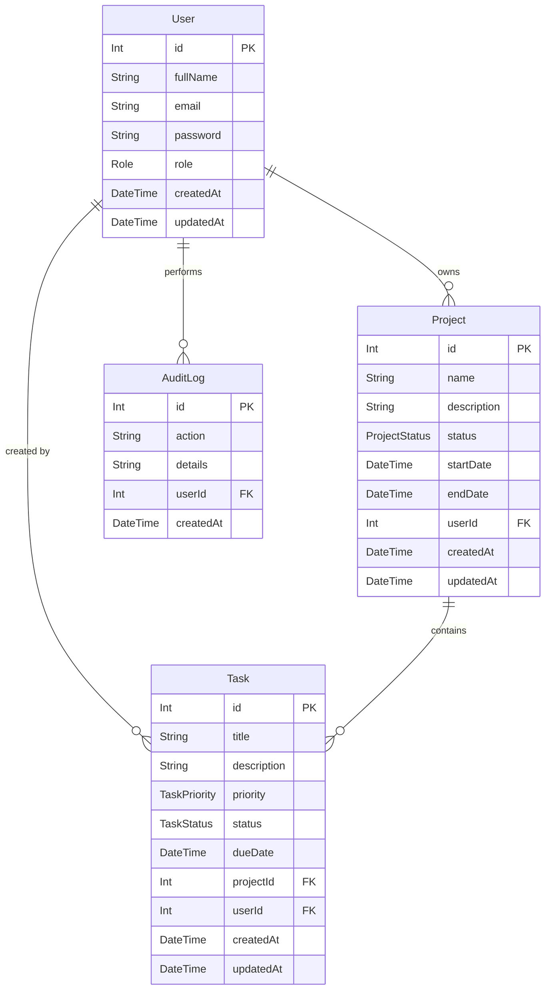

# Entity-Relationship (ER) Diagram

This document illustrates the data relationships within the Project Management System.

```mermaid
erDiagram
    User {
        Int id PK
        String fullName
        String email
        String password
        Role role
        DateTime createdAt
        DateTime updatedAt
    }
    
    Project {
        Int id PK
        String name
        String description
        ProjectStatus status
        DateTime startDate
        DateTime endDate
        Int userId FK
        DateTime createdAt
        DateTime updatedAt
    }
    
    Task {
        Int id PK
        String title
        String description
        TaskPriority priority
        TaskStatus status
        DateTime dueDate
        Int projectId FK
        Int userId FK
        DateTime createdAt
        DateTime updatedAt
    }
    
    AuditLog {
        Int id PK
        String action
        String details
        Int userId FK
        DateTime createdAt
    }

    User ||--o{ Project : "owns"
    User ||--o{ Task : "created by"
    User ||--o{ AuditLog : "performs"
    Project ||--o{ Task : "contains"
```

### Visual Diagram

